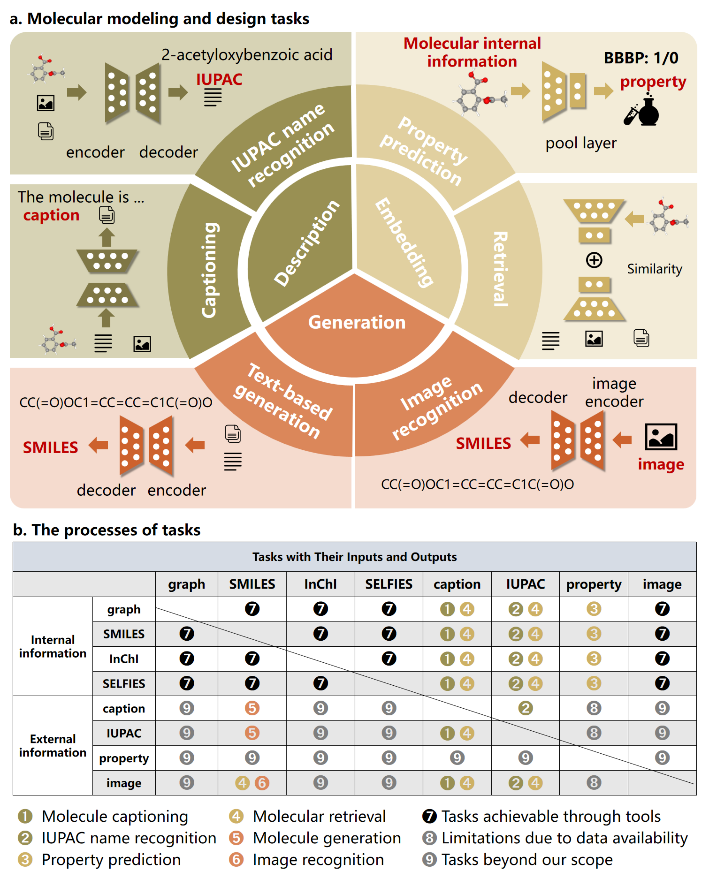

# LLM4Mol
[](https://arxiv.org/abs/2308.06911) 

Here, we address the gap in a comprehensive review of Transformer models and LLMs for molecular modeling and design, specifically in molecular recognition, generation, optimization, captioning, and property prediction. Moreover, this work reviews the models and creates a unified benchmark ChEBI-20-MM to conduct 1263 experiments to identify the key factors influencing the performance of these models. Finally, our review explores an end-to-end visual analysis, uncovering models' chemical intuition.
</br>
</br>

</br>
</br>
**This figure is overview of LLM4Mol**. **a. Molecular internal information**, including sequence and graph structure representations, emphasizes inherent chemical properties and simple topology; **b. Molecular external information**, e.g., images and text descriptions, provide richer details and help the human understanding; **c. Study case**, featuring molecule generation (from image, caption, or both to molecule) and molecule caption (from SMILES, graph, or both to caption). In molecule generation, our model accurately captures the organophosphate oxoanion structure as described in the caption. In comparison, MolT5 incorrectly represents the ring structure, and GPT-4 makes a mistake in the placement of the ketone functional group. GIT-Mol's output differs from the ground truth for the molecule caption task but still provides a correct and meaningful description of the SMILES string.

**The paradigm of the review. a. Molecular modeling and design tasks**, showcasing six task types with their standard modeling methods and data examples. **b. The processes of tasks**, we divide common molecular data into two categories: internal and external information. Internal information, integral to molecular representation, can be converted through various tools. External information is more accessible to human understanding. Additionally, this part highlights the research scope of our review, detailing the input and output for each task.

**Note:** The sections on the ChEBI-20-MM benchmark and Models below describe the contents of the respective directories. Due to size constraints and permissions, some data and ckpts may not be uploaded.

## ChEBI-20-MM
**We introduce ChEBI-20-MM, a benchmark developed from the ChEBI-20 dataset, integrating multi-modal data such as InChI, IUPAC, and images.**

`data` - This folder contains the data for finetuning models with Data of SMILES string, IUPAC name, InChI, SELFIES, and caption modalities.
- train.csv --26,406 No.
- validation.csv --3,300 No.
- test.csv --3,300 No.

`image` - Molecular images of ChEBI-20 from Pubchem
- cid.png

`MoleculeNet` - This folder contains the data for finetuning GIT-Mol for molecule properties prediction
- bbbp
- bace
- tox21
- clintox
- sider
- toxcast
- esol
- freesolv
- lipophilicity

The ChEBI-20 and MoleculeNet datasets can be downloaded from the following links:
- [ChEBI-20_data](https://github.com/blender-nlp/MolT5/tree/main/ChEBI-20_data)
- [MoleculeNet Datasets](https://moleculenet.org/datasets-1)


## Evaluation Framework

- `ckpts` - This folder contains checkpoints for finetuning
    - image_ckpts
        - [Swin Transformer-SwinOCSR](https://github.com/suanfaxiaohuo/SwinOCSR)
        - [Swin Transformer](https://github.com/suanfaxiaohuo/SwinOCSR)
        - [ResNet](https://huggingface.co/microsoft/swin-base-patch4-window7-224-in22k)
        - [ViT](https://huggingface.co/google/vit-base-patch16-224)
    - text_ckpts
        - Encoder-only
            - []
            - []
            - []
            - []
        - Decoder-only
            - []
            - []
            - []
            - []
        - Encoder-Decoder
            - [BART]
            - [T5]
            - [T5]
            - [] 
        
    - [MolT5-base](https://huggingface.co/laituan245/molt5-base)
    - [SciBERT](https://huggingface.co/allenai/scibert_scivocab_uncased)
- `configs`
    - config.json - Config file of this model
    - deepspeed_config.json - Config file of deepspeed in Accelerate
- `models`
    - GIT_Former.py - Code of GIT-Former
    - momu.py - Code of the graph encoder
    - momu_gnn.py - Code of the graph encoder
    - swin_transformer.py - Code of the image encoder
    - model_pretrain.py - Code of the pretraining model
    - model_finetune.py - Code of the finetuning model
- `dataset`
    - dataset.py
    - graph_featurizer.py
- `utils`
    - utils.py

## Training
`GIT-MOL`
- `evaluations` - Evaluations of molecule translation tasks
    - fingerprint_metrics.py
    - text_translation_metrics.py
    - mol_translation_metrics.py
- `train`
    - pretrain.py
    - `finetune`
        - molecule_translation.py - Finetuning of the molecule translation task
        - `property_prediction`
            - finetune.py - Finetuning of molecule properties prediction task
            - model.py
            - splitters.py
            - loader.py

**Below are the specific parameter explanations for the `property_prediction` task:**
### property_prediction -- finetune.py 
- `--modals`  
  Modalities used in this task contain graph2d, SMILES, or both.

- `--pool`  
  Type: `str`  
  Default: `avg`  
  Pooling function of text and graph embeddings. Options: Avg or Max.

- `--fusion_mode`  
  Type: `str`  
  Default: `attention`  
  If we use graph2d and SMILES modalities in this task, we can choose the fusion mode of the two embeddings. Options: Attention or Weights.

## References
```
[1]: Xu Z, Li J, Yang Z, et al. SwinOCSR: end-to-end optical chemical structure recognition using a Swin Transformer[J]. Journal of Cheminformatics, 2022, 14(1): 1-13.
[2]: Su B, Du D, Yang Z, et al. A molecular multimodal foundation model associating molecule graphs with natural language[J]. arXiv preprint arXiv:2209.05481, 2022.(https://arxiv.org/abs/2209.05481)
[3]: Edwards C, Lai T, Ros K, et al. Translation between molecules and natural language[J]. arXiv preprint arXiv:2204.11817, 2022.
[4]: Beltagy I, Lo K, Cohan A. SciBERT: A pretrained language model for scientific text[J]. arXiv preprint arXiv:1903.10676, 2019.
[5]: Li J, Li D, Savarese S, et al. Blip-2: Bootstrapping language-image pre-training with frozen image encoders and large language models[J]. arXiv preprint arXiv:2301.12597, 2023.
```
## Citation
```
@misc{liu2023gitmol,
      title={GIT-Mol: A Multi-modal Large Language Model for Molecular Science with Graph, Image, and Text}, 
      author={Pengfei Liu and Yiming Ren and Zhixiang Ren},
      year={2023},
      eprint={2308.06911},
      archivePrefix={arXiv},
      primaryClass={cs.LG}
}
```